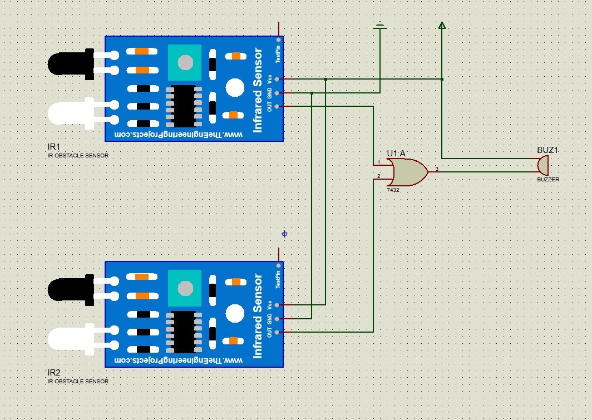
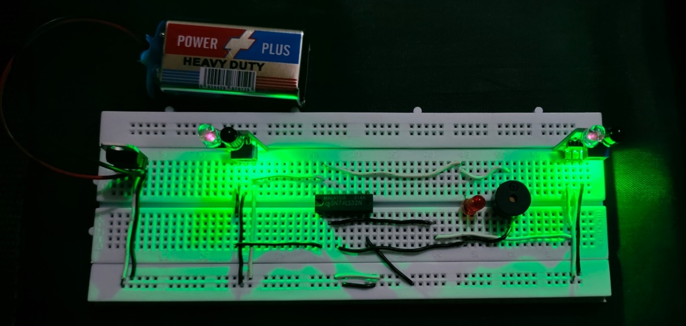
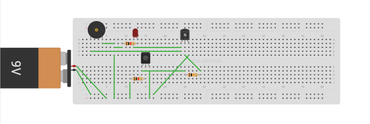
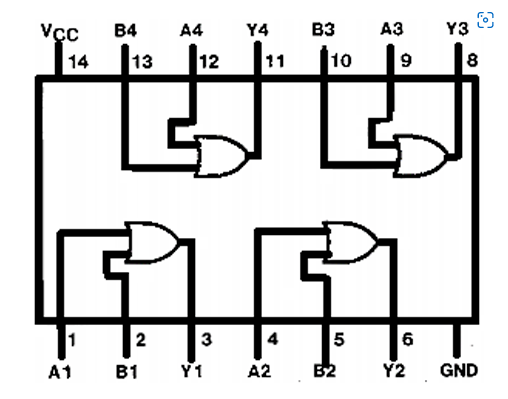

<div align="center">

# 🚨 IR Obstacle Sensor — Microcontroller-Free


A **microcontroller-free IR Obstacle Sensor** circuit built on a breadboard using purely digital logic components. The system uses two IR sensor modules wired through a **74LS32 OR gate IC** to trigger a buzzer and LED whenever an obstacle is detected — no Arduino, no code, just hardware logic.

</div>

---

## 📸 Project Images

<table>
  <tr>
    <td align="center"><br/><b>🔌 Circuit Schematic (Proteus Simulation)</b></td>
    <td align="center"><br/><b>⚡ Real Breadboard Build (Active)</b></td>
  </tr>
  <tr>
    <td align="center"><br/><b>🗺️ Wiring Diagram</b></td>
    <td align="center"><br/><b>🔲 74LS32 OR Gate IC Pinout</b></td>
  </tr>
</table>

---

## 🧠 How It Works

The circuit operates entirely on **combinational digital logic** — no microcontroller or programming required:

1. **Two IR Sensor Modules (IR1 & IR2)** continuously emit infrared light
2. When an obstacle reflects the IR beam back, the sensor's **OUT pin goes HIGH**
3. Both sensor outputs feed into a **74LS32 OR Gate IC (U1:A)**
4. If **either or both** sensors detect an obstacle → OR gate output goes HIGH
5. The HIGH signal activates the **Buzzer (BUZ1)** and **LED** as an alert

### Truth Table — OR Gate Logic

| IR1 (Input A) | IR2 (Input B) | OR Output | Alert |
|:---:|:---:|:---:|:---:|
| 0 (No obstacle) | 0 (No obstacle) | **0** | ❌ Silent |
| 1 (Obstacle) | 0 (No obstacle) | **1** | ✅ Buzzer + LED ON |
| 0 (No obstacle) | 1 (Obstacle) | **1** | ✅ Buzzer + LED ON |
| 1 (Obstacle) | 1 (Obstacle) | **1** | ✅ Buzzer + LED ON |

---

## 🧩 Components Used

| Component | Quantity | Purpose |
|---|:---:|---|
| **IR Obstacle Sensor Module** | 2 | Detects obstacles via infrared reflection |
| **74LS32 OR Gate IC** | 1 | Combines dual sensor signals using OR logic |
| **Buzzer** | 1 | Audible alert on obstacle detection |
| **LED (Red)** | 1 | Visual alert indicator |
| **NPN Transistor** | 1 | Signal amplification / switching |
| **Resistors** | 2–3 | Current limiting for LED and IR sensor |
| **9V Battery** | 1 | Power supply |
| **Breadboard** | 1 | Circuit assembly platform |
| **Jumper Wires** | Several | Component interconnections |

---

## 🔌 Circuit Design

### Block Diagram
```
[IR Sensor 1] ──→ ┐
                   ├──→ [OR Gate 74LS32] ──→ [Buzzer + LED]
[IR Sensor 2] ──→ ┘
```

### Key Design Decisions
- **74LS32 OR gate** — chosen so that *any single* sensor triggering fires the alarm (OR logic)
- **Dual-sensor setup** — expands detection coverage area
- **No microcontroller** — makes the circuit cheaper, simpler, and more reliable
- **NPN transistor** — ensures sufficient current to drive the buzzer

### 74LS32 IC — OR Gate Pinout
The **SN74LS32N** is a quad 2-input OR gate IC:
- **Pins 1, 2 → 3**: Gate A (used for this project — IR1 + IR2 inputs)
- **Pin 14**: VCC (+5V)
- **Pin 7**: GND
- Four independent OR gates per chip

---

## 🔧 Building the Circuit

### Step 1 — Power Setup
- Connect **9V battery** to the breadboard power rails (+V and GND)

### Step 2 — IR Sensor Connections
For each IR sensor module:
- **VCC** → +5V rail
- **GND** → GND rail
- **OUT** → input of the OR gate (Pin 1 for IR1, Pin 2 for IR2)

### Step 3 — OR Gate IC (74LS32)
- Pin **14** (VCC) → +5V rail
- Pin **7** (GND) → GND rail
- Pin **1** → IR Sensor 1 OUT
- Pin **2** → IR Sensor 2 OUT
- Pin **3** (Output Y1) → Buzzer positive terminal

### Step 4 — Buzzer & LED
- **Buzzer (+)** → OR gate output (Pin 3)
- **Buzzer (−)** → GND
- **LED** → in parallel with buzzer (with series resistor to GND)

---

## ✅ Testing the Circuit

1. Power the circuit with the 9V battery
2. With **no obstacle** → both LEDs should glow green (sensor active, no detection)
3. Place your hand in front of **either** IR sensor
4. The **buzzer should sound** and the **red LED should light up**
5. Remove your hand → buzzer and LED turn off

---

## 🔁 Possible Extensions

| Extension | Description |
|---|---|
| **Fire Alarm System** | Replace IR sensors with flame/smoke sensors |
| **Automatic Street Light** | Use LDR instead of IR, switch light via relay |
| **Security Alert System** | Add more sensors via additional OR gate inputs |
| **AND Gate Variant** | Use 74LS08 AND gate — alert only when *both* sensors trigger |
| **Motor Control** | Replace buzzer with relay module to control motors |

---

## 🧠 DLD Concepts Applied

| Concept | Application |
|---|---|
| **Combinational Logic** | Circuit output depends only on current sensor inputs |
| **OR Gate** | Core logic element — alarm fires if ANY sensor is triggered |
| **Boolean Algebra** | Output Y = A + B (OR of the two sensor signals) |
| **TTL Logic IC** | 74LS32 — standard TTL-series OR gate chip |
| **Digital Signal** | IR sensor output is a digital HIGH/LOW signal |
| **NPN Transistor as Switch** | Used to switch current for the buzzer load |
| **Proteus Simulation** | Circuit designed and simulated before physical build |

---

## 🛠️ Tools Used

| Tool | Purpose |
|---|---|
| **Proteus Design Suite** | Circuit simulation and schematic design |
| **Breadboard** | Physical circuit prototyping |
| **Multimeter** | Testing voltage levels and connections |
| **74LS32 Datasheet** | OR gate IC reference |

---

## 📄 License

```
MIT License

Copyright (c) IR Obstacle Sensor ---2026 AnasQ2003

Permission is hereby granted, free of charge, to any person obtaining a copy
of this software and associated documentation files (the "Software"), to deal
in the Software without restriction, including without limitation the rights
to use, copy, modify, merge, publish, distribute, sublicense, and/or sell
copies of the Software, and to permit persons to whom the Software is
furnished to do so, subject to the following conditions:

The above copyright notice and this permission notice shall be included in all
copies or substantial portions of the Software.

THE SOFTWARE IS PROVIDED "AS IS", WITHOUT WARRANTY OF ANY KIND, EXPRESS OR
IMPLIED, INCLUDING BUT NOT LIMITED TO THE WARRANTIES OF MERCHANTABILITY,
FITNESS FOR A PARTICULAR PURPOSE AND NONINFRINGEMENT.
```

---

## 👨‍💻 Author

**Anas Ahmed Qureshi.** — [@AnasQ2003](https://github.com/AnasQ2003)

---

<div align="center">
  <p>Built with ❤️ by <strong>Anas</strong></p>
  
 <div align="center">

Made with 🔥 and a lot of ☕

**⭐ If you found this useful, please star the repository!**

</div>

